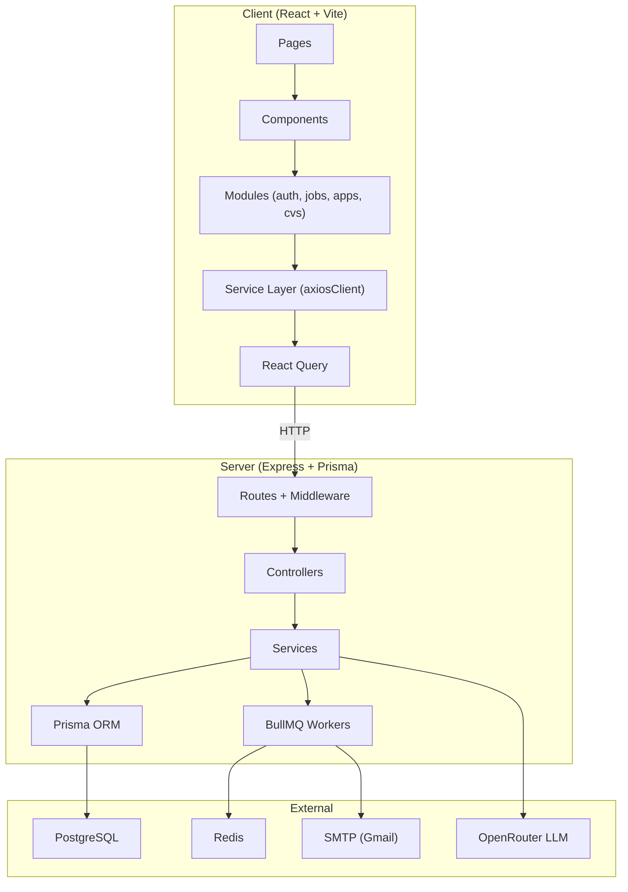

# 🔒 Full-Stack Project Audit Report — Kafoo (كُفُـؤ)

> **Auditor**: Senior Full-Stack Architect & Security Auditor  
> **Date**: 2026-04-12  
> **Scope**: Complete read-only analysis of `client/` and `server/` codebases  
> **Status**: ✅ Complete — No files were modified

---

## Executive Summary

Kafoo is a job-portal platform built with **React 18 + Vite + TypeScript** (client) and **Node.js + Express + Prisma + PostgreSQL** (server), featuring automated email outreach via BullMQ/Redis and a web-scraper subsystem. The codebase demonstrates **good modular architecture** and **solid authentication fundamentals**, but harbors **several critical and high-severity security vulnerabilities** that must be addressed before production deployment.

### Severity Distribution

| Severity | Count |
|----------|-------|
| 🔴 **CRITICAL** | 5 |
| 🟠 **HIGH** | 8 |
| 🟡 **MEDIUM** | 10 |
| 🔵 **LOW** | 7 |
| ⚪ **INFO** | 5 |

---

## 🔴 CRITICAL Issues (Immediate Action Required)

### CRIT-01: `.env` File Committed with Live Secrets

| Field | Detail |
|-------|--------|
| **Domain** | Configuration / Security |
| **File** | [.env](file:///d:/MINE/Software%20Engineering/Projects/Mostaql/kafoo/server/.env) |
| **OWASP** | A05:2021 — Security Misconfiguration |

**Description**: The server `.env` file is present in the repository and contains **real production credentials**:
- PostgreSQL password: `123456`
- SMTP Gmail credentials with a real app-password (`rlcgpjtmsmtzxlkb`)
- OpenRouter API key: `sk-or-v1-370ebcdb...`
- JWT secrets: `your-super-secret-jwt-key-change-in-production`
- Encryption key: `default-encryption-key-change-in-production`

While `.env` is listed in `.gitignore`, the file exists in the workspace and its placeholder secrets are trivially guessable (or **are actual live credentials for SMTP/LLM**).

**Impact**: Full compromise of database, email system, and third-party API accounts. Credential stuffing. Financial exposure via API key abuse.

**Recommended Fix**:
1. Rotate ALL secrets immediately (DB password, SMTP app-password, OpenRouter key, JWT secrets)
2. Use a secrets manager (e.g., Vault, AWS Secrets Manager, or at minimum secure env injection via CI/CD)
3. Enforce strong, randomly generated secrets (min 32 chars for JWT, 64 hex chars for encryption key)
4. Verify `.env` is not tracked in git history — if it is, rewrite history with `git filter-repo`

---

### CRIT-02: No Rate Limiting on Any Endpoint

| Field | Detail |
|-------|--------|
| **Domain** | API Security |
| **File** | [app.ts](file:///d:/MINE/Software%20Engineering/Projects/Mostaql/kafoo/server/src/app.ts), [auth.routes.ts](file:///d:/MINE/Software%20Engineering/Projects/Mostaql/kafoo/server/src/v1/modules/auth/auth.routes.ts) |
| **OWASP** | A04:2021 — Insecure Design |

**Description**: Despite defining `RATE_LIMIT_AUTH` and `RATE_LIMIT_API` constants in [constants.ts](file:///d:/MINE/Software%20Engineering/Projects/Mostaql/kafoo/server/src/config/constants.ts), **no rate-limiting middleware is actually applied** anywhere. There is no `express-rate-limit` import or middleware usage in the entire project.

**Impact**: Brute-force attacks on login, credential stuffing, enumeration of valid emails via forgot-password, and abuse of the email-send system (SMTP flooding).

**Recommended Fix**:
```typescript
// Example — apply in auth.routes.ts
import rateLimit from 'express-rate-limit';

const authLimiter = rateLimit({
  windowMs: APP_CONSTANTS.RATE_LIMIT_AUTH.windowMs,
  max: APP_CONSTANTS.RATE_LIMIT_AUTH.max,
  standardHeaders: true,
  legacyHeaders: false,
});

router.post('/login', authLimiter, validateBodyMiddleware(LoginDtoSchema), authController.login);
```

---

### CRIT-03: No CSRF Protection

| Field | Detail |
|-------|--------|
| **Domain** | Security |
| **Files** | All mutation endpoints |
| **OWASP** | A01:2021 — Broken Access Control |

**Description**: The application uses `httpOnly` cookies for refresh tokens with `withCredentials: true` on the client. However, **no CSRF protection mechanism exists** — no CSRF tokens, no `SameSite=Strict` enforcement in development (it's `lax`), and no double-submit cookie pattern.

In development mode, `cors` is set to `{ origin: true }`, accepting requests from **any origin**.

**Impact**: An attacker can craft a malicious page that triggers state-changing operations (logout, schedule applications, change password) using the victim's authenticated session.

**Recommended Fix**: Implement CSRF tokens using `csurf` or the double-submit cookie pattern, and enforce `SameSite=Strict` for refresh token cookies.

---

### CRIT-04: Job Creation Endpoints Lack Authorization

| Field | Detail |
|-------|--------|
| **Domain** | Access Control |
| **File** | [jobs.routes.ts](file:///d:/MINE/Software%20Engineering/Projects/Mostaql/kafoo/server/src/v1/modules/jobs/jobs.routes.ts#L18-L30) |
| **OWASP** | A01:2021 — Broken Access Control |

**Description**: The `POST /jobs` and `POST /jobs/bulk` endpoints require only `authenticationMiddleware` — **any authenticated user can create or bulk-create jobs**. There is no `authorizationMiddleware(UserRole.ADMIN)` guard.

**Impact**: Regular users can inject arbitrary job listings into the database, poisoning the job data, inserting phishing/spam content, or manipulating search results.

**Recommended Fix**:
```typescript
router.post('/', authenticationMiddleware, authorizationMiddleware(UserRole.ADMIN), ...);
router.post('/bulk', authenticationMiddleware, authorizationMiddleware(UserRole.ADMIN), ...);
```

---

### CRIT-05: Tracking Pixel Endpoint Is Unauthenticated and Unenumerable

| Field | Detail |
|-------|--------|
| **Domain** | Security / Information Disclosure |
| **File** | [tracking.routes.ts](file:///d:/MINE/Software%20Engineering/Projects/Mostaql/kafoo/server/src/v1/modules/tracking/tracking.routes.ts#L12) |
| **OWASP** | A04:2021 — Insecure Design |

**Description**: The `GET /api/v1/track/open/:token` endpoint accepts **any UUID-like token** without authentication or rate limiting. If tracking tokens are sequentially generated UUIDs (they use `randomUUID()` which is safe), this is lower risk. However, the tracking pixel URL is embedded in emails sent to external HR recipients, and the base URL uses `appConfig.appUrl` which is `http://localhost:5173` — **the tracking pixel will never work in production** because it points to the local frontend, not the server.

**Impact**: Email-open tracking is completely broken; the pixel URL generates a 404 on the recipient's side since it targets localhost.

**Recommended Fix**: Use `emailConfig.serverUrl` (the actual API server URL) instead of `appConfig.appUrl` (the frontend URL) in `tracking-pixel.util.ts`.

---

## 🟠 HIGH Severity Issues

### HIGH-01: TLS Certificate Verification Disabled

| Field | Detail |
|-------|--------|
| **Domain** | Security |
| **File** | [mailer.config.ts](file:///d:/MINE/Software%20Engineering/Projects/Mostaql/kafoo/server/src/config/mailer.config.ts#L18) |

**Description**: `tls: { rejectUnauthorized: false }` disables TLS certificate verification for all SMTP connections, making the application vulnerable to man-in-the-middle attacks.

**Impact**: Email credentials and content could be intercepted in transit.

---

### HIGH-02: forgotPassword Leaks User Existence

| Field | Detail |
|-------|--------|
| **Domain** | Auth / Information Disclosure |
| **File** | [auth.service.ts](file:///d:/MINE/Software%20Engineering/Projects/Mostaql/kafoo/server/src/v1/modules/auth/auth.service.ts#L213-L215) |

**Description**: `forgotPassword` throws `'User not found or inactive'` when an email doesn't exist, and `'Please verify your email first'` for unverified users. This allows enumeration of registered emails. Similarly, `register` reveals if a phone/email is already taken.

**Impact**: Attackers can determine which emails are registered, enabling targeted phishing or credential-stuffing attacks.

---

### HIGH-03: Admin Dashboard Uses Hardcoded Mock Data (Not Connected to Backend)  (don't make it right now)

| Field | Detail |
|-------|--------|
| **Domain** | Architecture / Security |
| **File** | [AdminDashboardLayout.tsx](file:///d:/MINE/Software%20Engineering/Projects/Mostaql/kafoo/client/src/pages/admin/AdminDashboardLayout.tsx) |

**Description**: The entire admin panel operates on **hardcoded mock data** from `adminData.ts`. User management (edit, suspend, delete), announcements, and scraper controls are client-side state manipulations with `useState` — **none of them call the actual backend API**. The admin panel is entirely non-functional.

**Impact**: The admin UI creates a false sense of control. All admin actions have zero effect on the real system. This is a critical gap between the frontend and the backend APIs that already exist (users module, with proper RBAC on the server side).

---

### HIGH-04: Gmail OAuth Integration Is Faked (handle all configuration and i will fill the credentials in env)

| Field | Detail |
|-------|--------|
| **Domain** | Architecture |
| **File** | [UserDashboardLayout.tsx](file:///d:/MINE/Software%20Engineering/Projects/Mostaql/kafoo/client/src/pages/user/UserDashboardLayout.tsx#L107-L119) |

**Description**: The `connectGmail` function simulates a connection with `setTimeout(900ms)` and stores `'true'` in `localStorage`. No OAuth flow exists. The `GmailToken` model in Prisma is defined but never used. The email-send system uses SMTP (the system's own credentials), not the user's Gmail.

**Impact**: Users are presented with a "Connect Gmail" feature that does nothing. The entire auto-apply workflow sends emails from the **system's SMTP account**, not the user's mailbox — which has serious deliverability and trust issues.

---

### HIGH-05: No Input Sanitization Anywhere

| Field | Detail |
|-------|--------|
| **Domain** | Security |
| **OWASP** | A03:2021 — Injection |

**Description**: No HTML/XSS sanitization exists anywhere in the codebase. While Zod handles type validation, user-supplied strings (names, email subjects, job titles) are inserted directly into HTML email templates without escaping. The email templates use string interpolation to build HTML.

**Impact**: Stored XSS via job titles or user names that get rendered in email templates. A malicious job title could include `<script>` tags that execute in the email client.

---

### HIGH-06: CV Upload Path Traversal Risk (don't save cvs)

| Field | Detail |
|-------|--------|
| **Domain** | Security |
| **File** | [cvs.routes.ts](file:///d:/MINE/Software%20Engineering/Projects/Mostaql/kafoo/server/src/v1/modules/cvs/cvs.routes.ts#L18-L19) |

**Description**: The multer `filename` function uses `file.originalname` directly in the output filename: `uniqueSuffix + '-' + file.originalname`. If `originalname` contains path traversal characters (e.g., `../../../etc/passwd`), this could write files outside the intended directory.

**Impact**: Arbitrary file write on the server. Although multer's disk storage typically handles this, the original filename should be sanitized.

---

### HIGH-07: Static File Directory Exposed Without Access Control

| Field | Detail |
|-------|--------|
| **Domain** | Security |
| **File** | [app.ts](file:///d:/MINE/Software%20Engineering/Projects/Mostaql/kafoo/server/src/app.ts#L28) |

**Description**: `app.use('/uploads', express.static(...))` serves the entire uploads directory (including user CVs) **without any authentication or authorization**. Any CVs uploaded by any user are publicly accessible if the URL is guessed.

**Impact**: Personal CV files (containing names, addresses, phone numbers) of all users are publicly downloadable.

---

### HIGH-08: resetPassword Endpoint Doesn't Check Token Expiry

| Field | Detail |
|-------|--------|
| **Domain** | Auth |
| **File** | [auth.service.ts](file:///d:/MINE/Software%20Engineering/Projects/Mostaql/kafoo/server/src/v1/modules/auth/auth.service.ts#L259-L263) |

**Description**: While `forgotPassword` sets `resetTokenExpiresAt` with a 30-minute window, `resetPassword` **never checks** this expiry timestamp. It only verifies the JWT and hash match, not the database-level expiry. The JWT's own expiry (24 hours from `JWT_VERIFICATION_EXPIRES_IN`) is much longer than the intended 30-minute window.

**Impact**: Reset tokens remain valid for up to 24 hours instead of the intended 30 minutes.

---

## 🟡 MEDIUM Severity Issues

### MED-02: CvsService Uses Module-Level Singleton Instead of DI

| Field | Detail |
|-------|--------|
| **Domain** | Architecture |
| **File** | [cvs.service.ts](file:///d:/MINE/Software%20Engineering/Projects/Mostaql/kafoo/server/src/v1/modules/cvs/cvs.service.ts#L1) |

**Description**: Unlike AuthService, JobsService, and ApplicationsService which accept `PrismaClient` via constructor injection, `CvsService` **imports the global `prisma` singleton directly**. This breaks the DI pattern and makes the service harder to test.

---

### MED-03: Duplicate Pagination Logic Across Services

| Field | Detail |
|-------|--------|
| **Domain** | Code Quality |
| **Files** | `jobs.service.ts`, `applications.service.ts`, `users.service.ts` |

**Description**: Each service implements its own `resolvePagination()` and `buildPaginationMeta()` methods with identical logic. This violates DRY and creates maintenance burden.

---

### MED-04: `saveAllVisible` / `removeAllSaved` Fire N Mutations Sequentially

| Field | Detail |
|-------|--------|
| **Domain** | Performance / API Design |
| **File** | [UserDashboardLayout.tsx](file:///d:/MINE/Software%20Engineering/Projects/Mostaql/kafoo/client/src/pages/user/UserDashboardLayout.tsx#L77-L105) |

**Description**: Saving/unsaving multiple jobs fires individual mutations in a `forEach` loop. With 20+ saved jobs, this triggers 20+ individual HTTP requests.

**Recommended Fix**: Implement batch save/unsave API endpoints.

---

### MED-05: `bulkCreateJobs` Is Not Atomic

| Field | Detail |
|-------|--------|
| **Domain** | Data Integrity |
| **File** | [jobs.service.ts](file:///d:/MINE/Software%20Engineering/Projects/Mostaql/kafoo/server/src/v1/modules/jobs/jobs.service.ts#L136-L194) |

**Description**: Bulk job creation loops through jobs one-by-one with individual `prisma.job.create()` calls instead of using `createMany` or a transaction. This is not atomic — partial failures leave the database in an inconsistent state.

---

### MED-06: Token Refresh Race Condition Window

| Field | Detail |
|-------|--------|
| **Domain** | Auth |
| **File** | [api.ts](file:///d:/MINE/Software%20Engineering/Projects/Mostaql/kafoo/client/src/services/api.ts) |

**Description**: The token refresh logic uses a module-level lock (`isRefreshing`). During the refresh window, failed requests are queued and retried with the new token. However, the lock state is never reset if the refresh **itself** receives a 401 (lines 89-97 set `isRefreshing = false` but don't reject the queue). Queued requests will hang indefinitely.

---

### MED-07: Logger Doesn't Persist to Files

| Field | Detail |
|-------|--------|
| **Domain** | Operations |
| **File** | [logger.util.ts](file:///d:/MINE/Software%20Engineering/Projects/Mostaql/kafoo/server/src/shared/utils/logger.util.ts) |

**Description**: Winston is configured with only a `Console` transport. In production, logs will be lost on process restart or crash. There is no file transport, no log rotation, and no external log aggregation.

---

### MED-08: `(job as any).jobId` Unsafe Type Assertion

| Field | Detail |
|-------|--------|
| **Domain** | Code Quality / Type Safety |
| **File** | [UserDashboardLayout.tsx](file:///d:/MINE/Software%20Engineering/Projects/Mostaql/kafoo/client/src/pages/user/UserDashboardLayout.tsx#L64) |

**Description**: `toggleSave` uses `(job as any).jobId` to access the job ID, bypassing TypeScript's type system entirely. The `UserJob` interface has `jobId?: string` as optional, but the cast hides potential runtime errors.

---

### MED-09: Password Validation Is Too Permissive (keep it)

| Field | Detail |
|-------|--------|
| **Domain** | Auth |
| **File** | [create-user.dto.ts](file:///d:/MINE/Software%20Engineering/Projects/Mostaql/kafoo/server/src/v1/modules/auth/dto/create-user.dto.ts) |

**Description**: Password validation only checks `min(8).max(100)`. There's no complexity requirements (uppercase, lowercase, numbers, special characters). No password breach database check.

---

### MED-10: Missing `hrEmail` Null Handling in Email Scheduling

| Field | Detail |
|-------|--------|
| **Domain** | Logic Bug |
| **File** | [applications.service.ts](file:///d:/MINE/Software%20Engineering/Projects/Mostaql/kafoo/server/src/v1/modules/applications/applications.service.ts#L144-L147) |

**Description**: When scheduling applications, jobs without `hrEmail` are silently skipped (`continue`). However, an `Application` record has already been created for that job. This leaves orphan applications in `SCHEDULED` status that will never be sent.

---

## 🔵 LOW Severity Issues

### LOW-01: Duplicate `APP_URL` in `.env`
The `.env` file defines `APP_URL` twice (lines 7 and 40) with different values (`http://localhost:5000` and `http://localhost:5173`). The second definition wins, but this is confusing.

### LOW-02: `useRouteError()` Called but Unused
In [NotFoundPage.tsx](file:///d:/MINE/Software%20Engineering/Projects/Mostaql/kafoo/client/src/pages/error/NotFoundPage.tsx#L4), `useRouteError()` is called but its return value is never used.

### LOW-03: Inline Styles in NotFoundPage and ErrorFallback
These components use large inline `CSSProperties` objects instead of the CSS Modules pattern used everywhere else. This is inconsistent with the codebase's styling approach.

### LOW-04: `PAGE_NAME` Constant is Unused
[userData.ts](file:///d:/MINE/Software%20Engineering/Projects/Mostaql/kafoo/client/src/components/user/sections/userData.ts#L26) exports `PAGE_NAME = '22.html'` which is never referenced. This looks like leftover debugging code.

### LOW-05: Mock Data Utilities Are Dead Code
`getSavedJobs`, `setSavedJobs`, `getApplications`, `setApplications` in `userData.ts` use `localStorage` but are never called — the app now uses React Query + API. These are dead code artifacts.

### LOW-06: Error Mapper Has Incorrect Translation
In [error-mapper.ts](file:///d:/MINE/Software%20Engineering/Projects/Mostaql/kafoo/client/src/lib/error-mapper.ts#L14), `'forbidden'` is mapped to `'مسموح'` (which means "allowed") — the opposite of forbidden. It should be `'غير مسموح'` or `'الدخول مرفوض'`.

### LOW-07: No Mobile Responsiveness Testing for Admin Panel
The admin panel has a `mobileSidebarOpen` state but the admin data tables and complex forms are not visually verified for mobile responsiveness.

---

## ⚪ INFO (Observations & Best Practices)

### INFO-01: Healthy Architecture Patterns
- ✅ Feature-based modular architecture on both client and server
- ✅ Zod DTOs for server-side validation
- ✅ Service → Controller → Routes separation on the backend
- ✅ React Query for server state management on the frontend
- ✅ Centralized error handling with custom AppError hierarchy
- ✅ Password hashing with bcrypt (12 rounds)
- ✅ Refresh token rotation with session tracking
- ✅ Account lockout on failed login attempts

### INFO-02: Good Cookie Security Defaults
The refresh token cookie uses `httpOnly: true`, `secure: isProduction`, and `sameSite` varies by environment. The access token is never stored in cookies (only in memory).

### INFO-03: Graceful Shutdown Handling
The server properly handles `SIGTERM`, `SIGINT`, `uncaughtException`, and `unhandledRejection` with DB disconnection.

### INFO-04: Prisma Singleton Pattern
The database config uses a global singleton pattern to prevent connection pool exhaustion during hot-reload in development.

### INFO-05: Schema-Level Unique Constraints
The Job model has a composite unique constraint `@@unique([title, companyName, location])` preventing duplicate job entries. User model has unique constraints on email and phone.

---

## 📋 Top 5 Priority Fixes

| Priority | Issue | Severity | Effort |
|----------|-------|----------|--------|
| **1** | **CRIT-01**: Rotate all exposed secrets, enforce secrets management | 🔴 Critical | Low |
| **2** | **CRIT-02**: Implement rate limiting on auth and API endpoints | 🔴 Critical | Low |
| **3** | **CRIT-04**: Add RBAC to job creation endpoints | 🔴 Critical | Low |
| **4** | **HIGH-07**: Add auth middleware to the `/uploads` static directory | 🟠 High | Medium |
| **5** | **CRIT-03**: Implement CSRF protection for cookie-based auth | 🔴 Critical | Medium |

---

## Architecture Diagram



---

## Files Audited

### Server (48 files analyzed)
All files under `server/src/` including: config, http/middlewares, shared/errors, shared/utils, v1/modules (auth, jobs, applications, cvs, users, tracking, health), scraper, workers, notifications, and configuration files (`.env`, `prisma/schema.prisma`, `tsconfig.json`).

### Client (35+ files analyzed)
All files under `client/src/` including: pages (home, auth, user, admin, error), components (home, user, admin, ui, error), modules (auth, jobs, applications, cvs), services, contexts, lib, and configuration files (`.env.development`, `.env.production`, `vite.config.ts`).

---

> **Disclaimer**: This audit is a point-in-time analysis. No code was modified. All findings should be validated in the context of the deployment environment and threat model before remediation.
